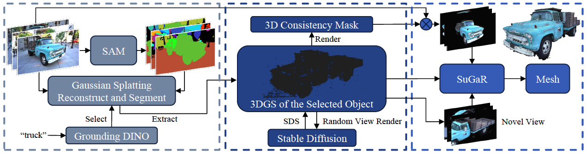

<div align="center">

# OMEGAS

<font size="4">
<a href="https://github.com/CrystalWlz" style="font-size:100%;">Lizhi Wang</a>&emsp;
Feng Zhou&emsp;
Bo Yu&emsp;
Pu Cao&emsp;
Jianqin Yin  
</font>
<br>

<font size="4">
Beijing University of Posts and Telecommunications, Beijing, China
</font>

 <a href="https://arxiv.org/abs/2404.15891">arXiv</a> 

 <br>
<b>Our method extracts meshes from 2D Gaussian Splatting reconstructions and build hybrid representations <br>that enable easy composition and animation in Gaussian Splatting scenes by manipulating the mesh.</b>
</div>

## Abstract

Recent advancements in 3D reconstruction technologies have paved the way for high-quality and real-time rendering of complex 3D scenes. Despite these achievements, a notable challenge persists: it is difficult to precisely reconstruct specific objects from large scenes. Current scene reconstruction techniques frequently result in the loss of object detail textures and are unable to reconstruct object portions that are occluded or unseen in views. To address this challenge, we delve into the meticulous 3D reconstruction of specific objects within large scenes and propose a framework termed OMEGAS: Object Mesh Extraction from Large Scenes Guided by Gaussian Segmentation. Specifically, we proposed a novel 3D target segmentation technique based on 2D Gaussian Splatting, which segments 3D consistent target masks in multi-view scene images and generates a preliminary target model. Moreover, to reconstruct the unseen portions of the target, we propose a novel target replenishment technique driven by large-scale generative diffusion priors. We demonstrate that our method can accurately reconstruct specific targets from large scenes, both quantitatively and qualitatively. Our experiments show that OMEGAS significantly outperforms existing reconstruction methods across various scenarios.


## BibTeX

```
@misc{wang2024omegasobjectmeshextraction,
      title={OMEGAS: Object Mesh Extraction from Large Scenes Guided by Gaussian Segmentation}, 
      author={Lizhi Wang and Feng Zhou and Bo yu and Pu Cao and Jianqin Yin},
      year={2024},
      eprint={2404.15891},
      archivePrefix={arXiv},
      primaryClass={cs.CV},
      url={https://arxiv.org/abs/2404.15891}, 
}
```


## Overview

<div align="center" >

</div><br>

## Installation

### 0. Requirements

The software requirements are the following:
- Conda (recommended for easy setup)
- C++ Compiler for PyTorch extensions
- CUDA toolkit 11.7 for PyTorch extensions
- C++ Compiler and CUDA SDK must be compatible

Please refer to the original <a href="https://github.com/graphdeco-inria/gaussian-splatting">3D Gaussian Splatting repository</a> for more details about requirements.

### 1. Clone the repository

Start by cloning this repository:

```shell
# HTTPS
git clone https://github.com/CrystalWlz/OMEGAS.git --recursive
```

or

```shell
# SSH
git clone git@github.com:CrystalWlz/OMEGAS.git --recursive
```

### 2. Install the required Python packages
To install the required Python packages and activate the environment, go inside the `OMEGAS/` directory and run the following commands:

```shell
conda env create -f environment.yml
conda activate omg
pip install -r requirements.txt
conda install pytorch3d::pytorch3d
```

<details>
<summary><span style="font-weight: bold;">If this command fails to create a working environment</span></summary>

Then you can try to install the required packages manually by running the following commands:
```shell
conda create --name gss -y python=3.9
conda activate gss
conda install pytorch==2.0.1 torchvision==0.15.2 torchaudio==2.0.2 pytorch-cuda=11.7 -c pytorch -c nvidia
conda install -c fvcore -c iopath -c conda-forge fvcore iopath
conda install pytorch3d -c pytorch3d==0.7.5
conda install -c plotly plotly
conda install -c conda-forge rich
conda install -c conda-forge plyfile==0.8.1
conda install -c conda-forge jupyterlab
conda install -c conda-forge nodejs
conda install -c conda-forge ipywidgets
pip install --upgrade PyMCubes
conda install pytorch3d::pytorch3d
```
</details>

### 3. Install the Gaussian Splatting rasterizer

Run the following commands inside the OMEGAS directory to install the additional Python submodules required for Gaussian Splatting:

```shell
cd gaussian_splatting/submodules/diff-gaussian-rasterization/
pip install -e .
cd ../diff-surfel-rasterization/
pip install .
cd ../simple-knn/
pip install -e .
cd ../../../
```
Please refer to the <a href="https://github.com/graphdeco-inria/gaussian-splatting">3D Gaussian Splatting repository</a> for more details.

### 4. Install the DEVA

```shell
cd Tracking-Anything-with-DEVA
pip install -e .
bash scripts/download_models.sh     # Download the pretrained models
cd ..

git clone https://github.com/hkchengrex/Grounded-Segment-Anything.git
cd Grounded-Segment-Anything
export AM_I_DOCKER=False
export BUILD_WITH_CUDA=True
python -m pip install -e segment_anything
python -m pip install -e GroundingDINO

cd ..
```

### 5. Install the SuGaR

To install the required Python packages and activate the environment, run the following commands:

```shell
cd SuGaR
conda env create -f environment.yml
conda activate sugar
```

<details>
<summary><span style="font-weight: bold;">If this command fails to create a working environment</span></summary>

Then you can try to install the required packages manually by running the following commands:
```shell
conda create --name sugar -y python=3.9
conda activate sugar
conda install pytorch==2.0.1 torchvision==0.15.2 torchaudio==2.0.2 pytorch-cuda=11.7 -c pytorch -c nvidia
conda install -c fvcore -c iopath -c conda-forge fvcore iopath
conda install pytorch3d==0.7.4 -c pytorch3d
conda install -c plotly plotly
conda install -c conda-forge rich
conda install -c conda-forge plyfile==0.8.1
conda install -c conda-forge jupyterlab
conda install -c conda-forge nodejs
conda install -c conda-forge ipywidgets
pip install open3d
pip install --upgrade PyMCubes
```
</details>

Run the following commands inside the sugar directory to install the additional Python submodules required for Gaussian Splatting:

```shell
cd gaussian_splatting/submodules/diff-gaussian-rasterization/
pip install -e .
cd ../simple-knn/
pip install -e .
cd ../../../
```
Please refer to the <a href="https://github.com/graphdeco-inria/gaussian-splatting">3D Gaussian Splatting repository</a> for more details.

## Quick Start

```shell
conda activate gss

bash script/prepare_pseudo_label.sh bear 1

python run_gaussian_2D.py -s data/truck -m output/truck_2D --depth_ratio 1.0

python gs_extract.py -s data/truck -m output/truck_2D/ --config_file configs/gaussian_dataset/truck.json --iteration 30000 --prompt "truck"

python dream_gaussian_2D.py --config configs/dream/dream_truck.yaml

python run_gaussian_2D.py -s output/truck_2D/object_104/refined -m output/truck_2D/object_104/refined --no_obj_loss --depth_ratio 1.0
``````

You can also manually select the ID of the target object and extract the Gaussian.

```shell
python extract_object.py -m output/truck_2D --config_file configs/gaussian_dataset/truck.json --iteration 30000 -s data/truck

# python render_obj.py -m output/truck_2d/object_104/ --config_file configs/gaussian_dataset/truck.json

copy classifier.pth

python dream_gaussian_2D.py --config configs/dream/dream_truck.yaml

copy points3D.ply
copy images

python run_gaussian_2D.py -s output/truck_2D/object_104/refined -m output/truck_2D/object_104/refined --no_obj_loss --depth_ratio 1.0 --lambda_dist 1000

python render_simple.py -m output/truck_2D/object_104/refined

python mesh_2D.py -s output/truck_2D/object_104/refined -m output/truck_2D/object_104/refined --iteration 30000 --depth_ratio 1.0 --voxel_size 0.004 --sdf_trunc 0.016 --depth_trunc 3.0
``````

Start by optimizing a vanilla Gaussian Splatting model for 7k iterations by running the script `gaussian_splatting/train.py`, as shown below. Please refer to the original <a href="https://github.com/graphdeco-inria/gaussian-splatting">3D Gaussian Splatting repository</a> for more details. This optimization should be very fast, and last only a few minutes.

```shell
cd SuGaR
conda activate sugar
python gaussian_splatting/train.py -s <path to COLMAP or NeRF Synthetic dataset> --iterations 7000 -m <path to the desired output directory>
```

Then, run the script `train.py` in the root directory to optimize a SuGaR model.

```shell
python train.py -s <path to COLMAP or NeRF Synthetic dataset> -c <path to the Gaussian Splatting checkpoint> -r <"density" or "sdf">
python train.py -s ~/Code/OMEGS/output/truck_test_cos/object_104/train/ours_7000/ -c ~/Code/OMEGS/output/truck_test_cos/object_104/ -r density --gpu 2
python train.py -s ~/Code/OMEGS/output/figurines/object_67/ -c ~/Code/OMEGS/output/figurines/object_67/ -r density --gpu 3

```


## Tips for using SuGaR on your own data and obtain better reconstructions


###  Estimate camera poses with COLMAP

Please first install a recent version of COLMAP (ideally CUDA-powered) and make sure to put the images you want to use in a directory `<location>/input`. Then, run the script `gaussian_splatting/convert.py` from the original Gaussian splatting implementation to compute the camera poses from the images using COLMAP. Please refer to the original <a href="https://github.com/graphdeco-inria/gaussian-splatting">3D Gaussian Splatting repository</a> for more details.

```shell
python gaussian_splatting/convert.py -s <location>
```

Sometimes COLMAP fails to reconstruct all images into the same model and hence produces multiple sub-models. The smaller sub-models generally contain only a few images. However, by default, the script `convert.py` will apply Image Undistortion only on the first sub-model, which may contain only a few images.

If this is the case, a simple solution is to keep only the largest sub-model and discard the others. To do this, open the source directory containing your input images, then open the sub-directory `<Source_directory>/distorted/sparse/`. You should see several sub-directories named `0/`, `1/`, etc., each containing a sub-model. Remove all sub-directories except the one containing the largest files, and rename it to `0/`. Then, run the script `convert.py` one more time but skip the matching process:

```shell
python gaussian_splatting/convert.py -s <location> --skip_matching
```

_Note: If the sub-models have common registered images, they could be merged into a single model as post-processing step using COLMAP; However, merging sub-models requires to run another global bundle adjustment after the merge, which can be time consuming._


## Evaluation

To evaluate the quality of the reconstructions, we provide a script `metrics.py` that computes the PSNR, SSIM and LPIPS metrics on test images. Start by optimizing SuGaR models for the desired scenes and a regularization method (`"density"` or `"sdf"`), then create a `.json` config file containing the paths to the scenes in the following format: `{source_images_dir_path: vanilla_gaussian_splatting_checkpoint_path}`.

Finally, run the script as follows:

```shell
python run_gaussian_2D.py -s data/teatime -m result/lerf_mask_2D/teatime --eval --train_split

python render_lerf_mask.py -m result/lerf_mask_2D/teatime --skip_train

python script/eval_lerf_mask.py teatime
```

Results are saved in a `.json` file in the `output/metrics/` directory. 
Please refer to the script for more details on the command line arguments.